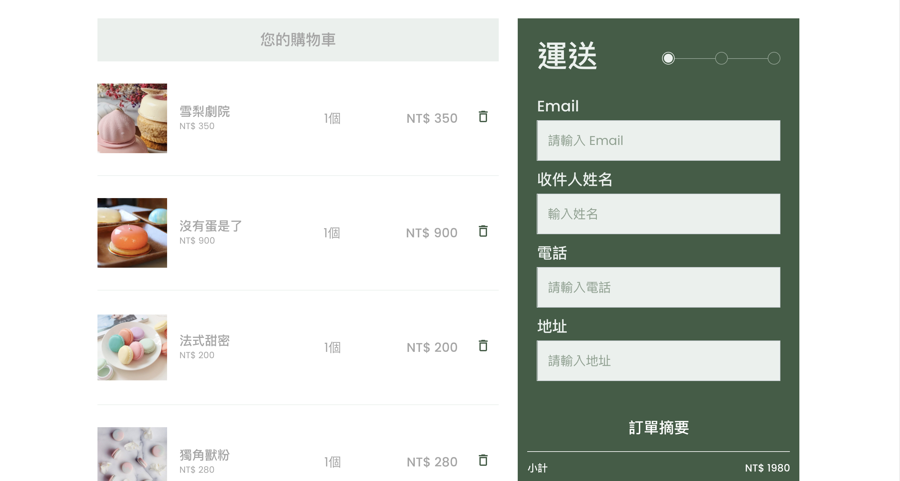
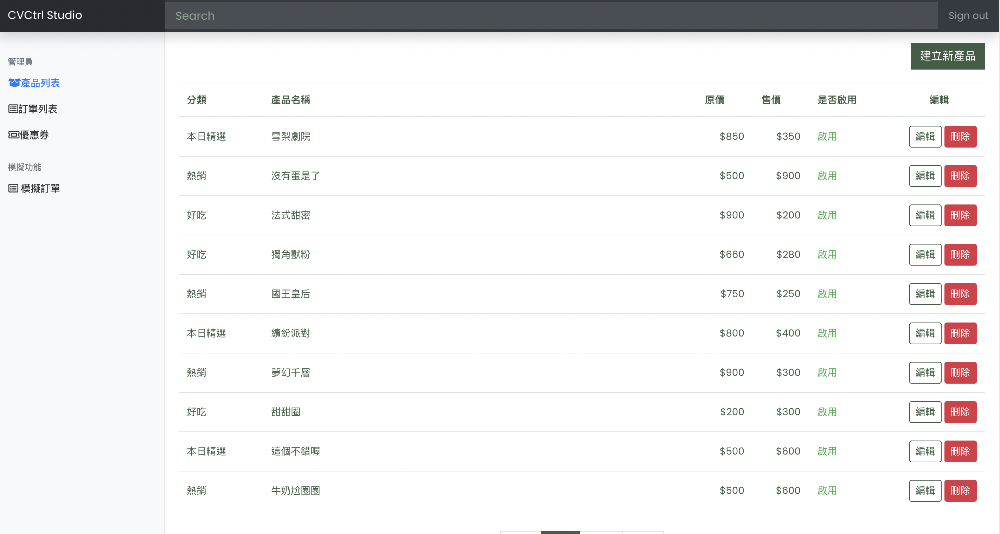

# 甜點購物商城

 一個用VUECLI打造前後台購物商城
 
 ### Demo:https://mikehsu0618.github.io/VueShoppingWeb/

</img>


---
 利用六角學院提供的ＡＰＩ實作出


> 購物車功能
>
</img>

> 結帳功能
>
</img>


>後台上架商品
>
>新增優惠券
>
>管理訂單資訊
>
</img>


## Build Setup

``` bash
# install dependencies
npm install

# serve with hot reload at localhost:8080
npm run dev

# build for production with minification
npm run build

# build for production and view the bundle analyzer report
npm run build --report
```

For a detailed explanation on how things work, check out the [guide](http://vuejs-templates.github.io/webpack/) and [docs for vue-loader](http://vuejs.github.io/vue-loader).
